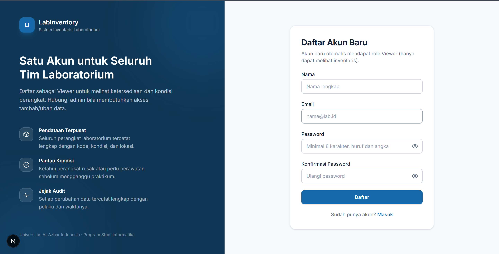

# LabInventory: Sistem Inventaris Laboratorium Komputer

Aplikasi web untuk mendata dan memantau perangkat laboratorium komputer: barang, kategori, kondisi, lokasi, pengguna, dan jejak audit. Dibangun sebagai proyek Ujian Akhir Semester dengan arsitektur terpisah antara **REST API backend** dan **aplikasi frontend**.

> **Tanpa ORM.** Seluruh akses basis data ditulis sebagai SQL manual melalui `mysql2/promise` dengan *prepared statement*. Tidak ada Prisma, Sequelize, TypeORM, maupun Drizzle di proyek ini.

---

## Daftar Isi

1. [Identitas](#identitas)
2. [Masalah yang Diselesaikan](#masalah-yang-diselesaikan)
3. [Fitur](#fitur)
4. [Teknologi](#teknologi)
5. [Arsitektur](#arsitektur)
6. [Struktur Folder](#struktur-folder)
7. [Prasyarat](#prasyarat)
8. [Cara Menjalankan dari Nol](#cara-menjalankan-dari-nol)
9. [Konfigurasi Environment](#konfigurasi-environment)
10. [Akun Demo](#akun-demo)
11. [Matriks Hak Akses](#matriks-hak-akses)
12. [Endpoint Utama](#endpoint-utama)
13. [Pengujian](#pengujian)
14. [Troubleshooting](#troubleshooting)
15. [Dokumentasi Lain](#dokumentasi-lain)

---

## Identitas

| | |
| :--- | :--- |
| **Nama** | Muhammad Nafi Azka Soleiman |
| **NIM** | 0102522017 |
| **Mata Kuliah** | Pemrograman Web Dinamis (UAS) |
| **Program Studi** | Informatika |
| **Institusi** | Universitas Al-Azhar Indonesia |

---

## Masalah yang Diselesaikan

Laboratorium komputer kampus umumnya mencatat perangkat di spreadsheet yang disalin ke banyak tempat. Akibatnya: jumlah perangkat tidak akurat, kondisi rusak baru diketahui saat praktikum berlangsung, dan tidak ada catatan siapa mengubah data apa.

LabInventory menjawab tiga hal itu:

1. **Satu sumber data.** Semua perangkat tercatat di satu basis data dengan kode unik, kategori, kondisi, lokasi, dan jumlah.
2. **Kondisi terpantau.** Dashboard menampilkan berapa perangkat yang Baik, Perlu Perawatan, Rusak, dan Tidak Aktif, sehingga perawatan bisa dijadwalkan sebelum mengganggu kegiatan.
3. **Ada pertanggungjawaban.** Setiap login dan setiap perubahan data tercatat di tabel `aktivitas_sistem` lengkap dengan pelaku, entitas, waktu, dan IP.

---

## Fitur

### Autentikasi & Otorisasi
- Login/logout dengan **JWT di dalam cookie HttpOnly** (tidak bisa dibaca JavaScript), serta dukungan header `Authorization: Bearer` untuk pengujian API.
- Registrasi publik selalu menghasilkan role **viewer** (role tidak dapat dinaikkan sendiri dari form).
- Password di-hash **bcrypt cost 10**. Hash tidak pernah keluar dari server.
- Opsi **"Ingat saya"** memperpanjang masa berlaku token dari 8 jam menjadi 7 hari.
- **Rate limit** 10 percobaan login per 15 menit per IP untuk memperlambat penebakan password.
- Tiga role: **admin**, **operator**, **viewer**: ditegakkan di backend (middleware) sekaligus di frontend (menu + route guard).

### Dashboard
- Kartu statistik: total barang, total kategori, kondisi baik, dan perlu perhatian.
- Grafik distribusi kondisi dan distribusi kategori.
- Daftar barang terbaru dan daftar barang yang perlu perhatian.

### Inventaris Barang
- CRUD lengkap dengan validasi di sisi server maupun klien.
- **Pencarian** berdasarkan kode atau nama barang (case-insensitive), **filter** kategori/kondisi/lokasi, **pengurutan** dengan whitelist kolom, dan **pagination**.
- Filter tersimpan di URL, sehingga halaman hasil pencarian bisa dibagikan atau di-*refresh* tanpa kehilangan konteks.
- **Upload foto** (JPG/PNG/WebP, maksimal 2 MB) dengan nama berkas diacak di server. Foto lama otomatis dihapus saat diganti atau saat barang dihapus.

### Kategori Barang
- CRUD kategori dengan proteksi nama duplikat.
- Kategori yang masih dipakai barang **tidak dapat dihapus**: dijaga oleh `FOREIGN KEY ... ON DELETE RESTRICT` di basis data sekaligus pengecekan eksplisit di lapisan layanan yang memunculkan pesan jelas ("masih dipakai N barang").

### Manajemen User (admin)
- Tambah, ubah, dan hapus akun; ubah role.
- **Reset password** pengguna lain langsung oleh admin (tanpa alur email).
- Pengaman: admin tidak dapat menghapus akunnya sendiri, dan sistem menolak menghapus/menurunkan **admin terakhir** agar sistem tidak pernah kehilangan administrator.

### Profil
- Setiap pengguna dapat memperbarui nama dan email miliknya sendiri. Role ditampilkan sebagai informasi baca-saja.

### Aktivitas Sistem (admin)
- Riwayat LOGIN, CREATE, UPDATE, DELETE, dan RESET_PASSWORD lengkap dengan pelaku, entitas, detail, IP, dan waktu; dilengkapi filter dan pagination.

### Antarmuka
- Tema putih–biru sesuai rancangan: sidebar navy `#0F3654`, warna utama `#1769AA`, teks `#142033`.
- **Sidebar dapat diciutkan** (256px ↔ 80px) dan status ciutnya diingat antar kunjungan; di layar kecil berubah menjadi drawer yang dapat ditutup dengan tombol `Esc` atau klik di luar.
- Responsif: tabel berubah menjadi daftar kartu di layar sempit. Diverifikasi tidak ada overflow horizontal pada 1366×768 dan 390×844.
- Toast notifikasi, dialog konfirmasi, *skeleton loading*, serta halaman 403 dan error yang rapi.

---

## Teknologi

| Lapisan | Teknologi | Catatan |
| :--- | :--- | :--- |
| **Runtime** | Node.js 20+ | |
| **Backend** | Express 5 + TypeScript (strict) | Port **3000** |
| **Frontend** | Next.js 16 (App Router) + React 19 + TypeScript | Port **3001**, Turbopack |
| **Styling** | Tailwind CSS v4 | Token warna lewat `@theme inline` |
| **Ikon** | SVG inline buatan sendiri | Tanpa dependency library ikon |
| **Basis data** | MySQL / MariaDB (XAMPP) | Basis data `inventaris_laboratorium` |
| **Driver DB** | `mysql2/promise` | Prepared statement manual, **tanpa ORM** |
| **Autentikasi** | `jsonwebtoken`, `bcrypt`, `cookie-parser` | JWT di cookie HttpOnly |
| **Validasi** | `express-validator` | Validasi body, query, dan param |
| **Upload** | `multer` | diskStorage, nama berkas acak |
| **Keamanan** | `helmet`, `cors`, `express-rate-limit` | |
| **Pengujian** | Jest + Supertest | 65 pengujian integrasi terhadap basis data nyata |

---

## Arsitektur

Backend memakai pemisahan lapisan yang tegas: setiap lapisan hanya boleh memanggil lapisan di bawahnya:

```
Request
   ↓
rute/          → mendaftarkan endpoint, memasang middleware auth/role/validasi
   ↓
middleware/    → autentikasi (verifikasi JWT), otorisasi (cek role), validasi, upload
   ↓
controller/    → membaca req, memanggil layanan, membentuk respons baku
   ↓
layanan/       → aturan bisnis (duplikat, konflik, transaksi, siklus hidup foto)
   ↓
repository/    → SATU-SATUNYA tempat query SQL ditulis
   ↓
MySQL
```

Manfaat praktisnya: **semua SQL terkumpul di satu folder**, sehingga saat memeriksa keamanan query cukup membaca `backend/src/repository/`.

Seluruh respons API memakai format yang sama:

```jsonc
// sukses
{ "sukses": true, "pesan": "...", "data": { }, "meta": { "halaman": 1, "batas": 10, "totalData": 10, "totalHalaman": 1 } }

// gagal
{ "sukses": false, "pesan": "...", "kesalahan": [ { "field": "email", "pesan": "Format email tidak valid." } ] }
```

---

## Struktur Folder

Folder buatan sendiri diberi nama Bahasa Indonesia; nama yang diwajibkan framework (`src`, `app`, `public`) tetap memakai konvensi teknis.

```text
UAS Sistem Inventaris Laboratorium/
├── backend/
│   ├── src/
│   │   ├── konfigurasi/      # environment, pool database, konstanta upload
│   │   ├── rute/             # definisi endpoint Express
│   │   ├── middleware/       # autentikasi, otorisasi, validasi, unggah, penangan error
│   │   ├── controller/       # penerjemah request ↔ respons
│   │   ├── layanan/          # aturan bisnis
│   │   ├── repository/       # SQL + prepared statement (satu-satunya akses DB)
│   │   ├── validasi/         # skema express-validator
│   │   ├── utilitas/         # jwt, cookie, respons, logger, transaksi, berkas
│   │   ├── tipe/             # tipe TypeScript dan kelas error aplikasi
│   │   ├── aplikasi.ts       # perakitan instance Express
│   │   └── server.ts         # titik masuk (listen + graceful shutdown)
│   ├── tes/                  # 7 berkas pengujian Jest + Supertest
│   ├── unggahan/barang/      # penyimpanan foto barang
│   └── .env.example
│
├── frontend/
│   ├── src/
│   │   ├── app/              # routing Next.js App Router
│   │   ├── fitur/            # komponen per fitur (barang, kategori, user, ...)
│   │   ├── komponen/         # komponen UI yang dipakai ulang
│   │   ├── konteks/          # React Context (auth, toast)
│   │   ├── layanan-api/      # pembungkus fetch ke backend
│   │   ├── konstanta/        # menu, role, kondisi, aksi aktivitas
│   │   ├── hook/             # custom hook (debounce)
│   │   ├── tipe/             # tipe TypeScript
│   │   └── utilitas/         # format tanggal, izin role, query string
│   └── .env.local.example
│
├── database/
│   └── inventaris.sql        # skema + data awal (siap impor)
│
├── dokumentasi/
│   ├── API.md                # kontrak seluruh endpoint
│   ├── DEMO.md               # skenario demo 8–12 menit
│   └── KONSEP-TEKNIS.md      # penjelasan konsep + tanya jawab
│
└── README.md
```

---

## Prasyarat

| Kebutuhan | Versi | Cara memeriksa |
| :--- | :--- | :--- |
| Node.js | 20 atau lebih baru | `node -v` |
| npm | 10 atau lebih baru | `npm -v` |
| XAMPP (MySQL/MariaDB) | MariaDB 10.4+ | jalankan XAMPP Control Panel |

Modul **Apache tidak wajib** dijalankan (hanya dibutuhkan jika Anda ingin memakai phpMyAdmin untuk mengimpor basis data).

---

## Cara Menjalankan dari Nol

### 1. Nyalakan basis data

Buka **XAMPP Control Panel** → tombol **Start** pada modul **MySQL** (dan **Apache** bila ingin memakai phpMyAdmin).

### 2. Impor basis data

Berkas `database/inventaris.sql` sudah berisi perintah `DROP DATABASE` + `CREATE DATABASE`, jadi **tidak perlu membuat basis data secara manual** dan aman dijalankan berulang kali.

**Lewat phpMyAdmin**
1. Buka `http://localhost/phpmyadmin`.
2. Klik tab **Import** → **Choose File** → pilih `database/inventaris.sql`.
3. Klik **Go**. Setelah selesai, basis data `inventaris_laboratorium` berisi 4 tabel.

**Lewat terminal** (lebih cepat)
```bash
"C:/xampp/mysql/bin/mysql" -u root < "database/inventaris.sql"
```

Impor yang berhasil akan menampilkan ringkasan:

```
tabel              jumlah_data
kategori_barang    6
barang             10
users              3
aktivitas_sistem   3
```

### 3. Jalankan backend (port 3000)

```bash
cd backend
copy .env.example .env      # macOS/Linux: cp .env.example .env
npm install
npm run dev
```

Buka `.env` dan isi **`JWT_SECRET`** dengan teks acak minimal 32 karakter. Server sengaja menolak berjalan bila nilai ini kosong atau terlalu pendek.

Backend siap ketika terminal menampilkan:

```
[INFO] Koneksi database berhasil ke 127.0.0.1:3306/inventaris_laboratorium.
[INFO] Server LabInventory backend berjalan pada http://localhost:3000 (mode development)
```

Uji cepat: buka `http://localhost:3000/api/health` → `{"sukses":true, ...,"status":"ok"}`.

### 4. Jalankan frontend (port 3001)

Buka **terminal kedua** (biarkan backend tetap berjalan):

```bash
cd frontend
copy .env.local.example .env.local     # macOS/Linux: cp .env.local.example .env.local
npm install
npm run dev
```

### 5. Buka aplikasi

Akses `http://localhost:3001` lalu masuk memakai salah satu [akun demo](#akun-demo).

### Ringkasan perintah

```bash
# Terminal 1: basis data + backend
"C:/xampp/mysql/bin/mysql" -u root < "database/inventaris.sql"
cd backend && npm install && npm run dev

# Terminal 2: frontend
cd frontend && npm install && npm run dev

# Buka http://localhost:3001
```

### Menjalankan mode produksi

```bash
cd backend  && npm run build && npm start    # dist/server.js, port 3000
cd frontend && npm run build && npm start    # port 3001
```

---

## Konfigurasi Environment

Berkas `.env` **tidak pernah di-commit** (sudah masuk `.gitignore`). Yang dibagikan hanya berkas contohnya.

### `backend/.env`

| Variabel | Wajib | Contoh | Keterangan |
| :--- | :---: | :--- | :--- |
| `NODE_ENV` | – | `development` | `production` menyembunyikan detail pesan error internal |
| `PORT` | ✔ | `3000` | Port backend |
| `FRONTEND_URL` | ✔ | `http://localhost:3001` | Satu-satunya origin yang diizinkan CORS |
| `DB_HOST` | ✔ | `127.0.0.1` | |
| `DB_PORT` | ✔ | `3306` | |
| `DB_USER` | ✔ | `root` | Pengguna MySQL bawaan XAMPP |
| `DB_PASSWORD` | – | *(kosong)* | XAMPP standar tidak memakai password |
| `DB_NAME` | ✔ | `inventaris_laboratorium` | |
| `JWT_SECRET` | ✔ | *(acak, ≥32 karakter)* | **Isi sendiri.** Server menolak start bila kurang dari 32 karakter |
| `JWT_EXPIRES_IN` | ✔ | `8h` | Masa berlaku token normal |
| `JWT_EXPIRES_IN_INGAT_SAYA` | – | `7d` | Masa berlaku bila "Ingat saya" dicentang |
| `UPLOAD_MAX_MB` | – | `2` | Batas ukuran foto barang |

### `frontend/.env.local`

| Variabel | Contoh | Keterangan |
| :--- | :--- | :--- |
| `NEXT_PUBLIC_API_URL` | `http://localhost:3000/api` | Alamat REST API |
| `NEXT_PUBLIC_UPLOAD_URL` | `http://localhost:3000/uploads` | Alamat berkas foto |

> Variabel `NEXT_PUBLIC_*` ikut terkirim ke browser, jadi **jangan** menaruh rahasia di sini.

---

## Akun Demo

Tersedia otomatis setelah `database/inventaris.sql` diimpor.

| Role | Email | Password | Ringkasan hak akses |
| :--- | :--- | :--- | :--- |
| **Admin** | `admin@uai.ac.id` | `admin12345` | Seluruh fitur, termasuk manajemen user, hapus data, dan log aktivitas |
| **Operator** | `staff@uai.ac.id` | `staff12345` | Kelola barang & kategori (tambah/ubah), tanpa hak hapus dan tanpa akses user/aktivitas |
| **Viewer** | `nafiazka2003@gmail.com` | `Nafi12345` | Hanya melihat dashboard dan daftar barang |

> Ini kredensial **demo** untuk penilaian. Ganti sebelum dipakai di lingkungan nyata.

---

## Matriks Hak Akses

Diverifikasi dengan login berurutan sebagai ketiga akun di browser sungguhan.

### Menu yang terlihat di sidebar

| Menu | Admin | Operator | Viewer |
| :--- | :---: | :---: | :---: |
| Dashboard | ✔ | ✔ | ✔ |
| Inventaris Barang | ✔ | ✔ | ✔ |
| Kategori Barang | ✔ | ✔ | – |
| Manajemen User | ✔ | – | – |
| Aktivitas Sistem | ✔ | – | – |
| Profil | ✔ | ✔ | ✔ |

### Bila URL diketik manual

| Route | Admin | Operator | Viewer |
| :--- | :---: | :---: | :---: |
| `/dashboard`, `/inventaris-barang`, `/profil` | tampil | tampil | tampil |
| `/kategori-barang` | tampil | tampil | **403** |
| `/manajemen-user` | tampil | **403** | **403** |
| `/aktivitas-sistem` | tampil | **403** | **403** |

### Aksi terhadap data

| Aksi | Admin | Operator | Viewer |
| :--- | :---: | :---: | :---: |
| Lihat barang | ✔ | ✔ | ✔ |
| Tambah / ubah barang + upload foto | ✔ | ✔ | – |
| **Hapus barang** | ✔ | – | – |
| Lihat / tambah / ubah kategori | ✔ | ✔ | – |
| **Hapus kategori** | ✔ | – | – |
| Manajemen user & reset password | ✔ | – | – |
| Lihat aktivitas sistem | ✔ | – | – |

> Menyembunyikan menu **bukan** mekanisme keamanannya. Setiap endpoint tetap diperiksa ulang di backend, sehingga memanggil API secara langsung tetap menghasilkan `403`.

---

## Endpoint Utama

Kontrak lengkap beserta bentuk request/response ada di **[dokumentasi/API.md](dokumentasi/API.md)**.

| Metode | Endpoint | Role |
| :--- | :--- | :--- |
| `GET` | `/api/health` | publik |
| `POST` | `/api/auth/register` | publik |
| `POST` | `/api/auth/login` | publik |
| `GET` | `/api/auth/me` | login |
| `POST` | `/api/auth/logout` | login |
| `GET` | `/api/dashboard` | login |
| `GET` | `/api/barang` | login |
| `GET` | `/api/barang/:id` | login |
| `GET` | `/api/barang/opsi-lokasi` | login |
| `POST` | `/api/barang` | admin, operator |
| `PUT` | `/api/barang/:id` | admin, operator |
| `DELETE` | `/api/barang/:id` | **admin** |
| `GET` | `/api/kategori` | admin, operator |
| `POST` | `/api/kategori` | admin, operator |
| `PUT` | `/api/kategori/:id` | admin, operator |
| `DELETE` | `/api/kategori/:id` | **admin** |
| `GET` | `/api/users` | admin |
| `GET` | `/api/users/:id` | admin |
| `POST` | `/api/users` | admin |
| `PUT` | `/api/users/:id` | admin |
| `DELETE` | `/api/users/:id` | admin |
| `PATCH` | `/api/users/:id/reset-password` | admin |
| `GET` | `/api/profil` | login |
| `PUT` | `/api/profil` | login |
| `GET` | `/api/aktivitas` | admin |

Foto barang disajikan statis di `GET /uploads/barang/<nama-berkas>`.

---

## Pengujian

Pengujian backend berjalan terhadap **basis data MySQL yang sesungguhnya**, bukan tiruan, sehingga *foreign key*, `UNIQUE`, dan transaksi ikut teruji.

```bash
cd backend
npm run lint        # ESLint untuk src dan tes
npx tsc --noEmit    # pemeriksaan tipe
npm test            # Jest + Supertest
```

```bash
cd frontend
npm run lint
npx tsc --noEmit
npm run build
```

Cakupan pengujian backend meliputi: login ketiga role, token rusak/kedaluwarsa, matriks role di seluruh endpoint, CRUD kategori & barang, konflik duplikat (409), kategori terpakai (409), 404 konsisten, validasi (422), siklus hidup upload (file lama dihapus, penolakan PDF 400, ukuran berlebih 413), reset password, larangan menghapus akun sendiri dan admin terakhir, penyajian berkas statis, serta jalur error 500 yang terkontrol.

> **Catatan:** menjalankan `npm test` menambah dan menghapus data uji, lalu mengembalikan keadaan basis data. Bila ingin benar-benar bersih untuk demo, impor ulang `database/inventaris.sql`.

---

## Troubleshooting

| Gejala | Penyebab | Solusi |
| :--- | :--- | :--- |
| `Gagal terhubung ke database ... (ECONNREFUSED)` | MySQL belum jalan | Start modul **MySQL** di XAMPP |
| `Database "inventaris_laboratorium" belum ada` | Belum impor SQL | Impor `database/inventaris.sql` |
| `JWT_SECRET wajib memiliki panjang minimal 32 karakter` | `.env` belum diisi | Isi `JWT_SECRET` dengan teks acak ≥32 karakter |
| `Konfigurasi environment tidak lengkap` | `.env` belum dibuat | Salin `.env.example` menjadi `.env` |
| `EADDRINUSE :3000` / `:3001` | Port terpakai proses lain | Tutup proses lama, atau `npx kill-port 3000 3001` |
| Login terus `401` padahal password benar | Basis data belum terimpor ulang setelah eksperimen | Impor ulang `database/inventaris.sql` |
| `429 Terlalu banyak percobaan login` | Rate limit 10 percobaan / 15 menit per IP | Tunggu 15 menit **atau** restart backend (penghitung disimpan di memori) |
| Halaman frontend tampil tetapi data kosong | Backend mati atau `NEXT_PUBLIC_API_URL` salah | Pastikan backend hidup di port 3000 dan `.env.local` benar |
| Foto barang tidak muncul | `NEXT_PUBLIC_UPLOAD_URL` salah, atau berkas tidak ada di `backend/unggahan/barang/` | Samakan dengan `.env.local.example`; pastikan `default-barang.png` ada |
| Kategori gagal dihapus (`409`) | Masih ada barang memakai kategori tersebut | Pindahkan atau hapus barangnya lebih dulu (ini memang perilaku yang diinginkan) |
| Perubahan `.env` tidak terasa | Variabel dibaca saat proses start | Hentikan lalu jalankan ulang server |

---

## Tampilan Aplikasi (Screenshot)

Screenshot lengkap aplikasi tersimpan di folder [`dokumentasi/screenshot/`](dokumentasi/screenshot/). Berikut sejumlah tampilan utama:

### Autentikasi

| Login (Admin) | Login (Staff/Operator) | Login (Viewer) |
| :---: | :---: | :---: |
|  |  |  |

| Halaman Login | Halaman Register |
| :---: | :---: |
|  |  |

### Dashboard

| Dashboard Admin | Dashboard Staff | Dashboard Viewer |
| :---: | :---: | :---: |
|  |  |  |

### Inventaris Barang

| Daftar Barang | Form Tambah Barang | Form Diisi |
| :---: | :---: | :---: |
|  |  |  |

| Barang Berhasil Ditambah | Edit Form | Edit Berhasil |
| :---: | :---: | :---: |
|  |  |  |

| Konfirmasi Hapus Barang | Hapus Barang Berhasil |
| :---: | :---: |
|  |  |

### Kategori Barang

| Daftar Kategori | Form Kategori | Kategori Berhasil Ditambah |
| :---: | :---: | :---: |
|  |  |  |

| Konfirmasi Hapus Kategori | Hapus Kategori Berhasil |
| :---: | :---: |
|  |  |

### Manajemen User dan Profil

| Manajemen User | Form Reset Password | Ubah Profil |
| :---: | :---: | :---: |
|  |  |  |

### Tampilan per Role (Operator)

| Inventaris (Staff) | Kategori (Staff) |
| :---: | :---: |
|  |  |

### Tampilan per Role (Viewer)

| Inventaris (Viewer) |
| :---: |
|  |

### Aktivitas Sistem

| Log Aktivitas |
| :---: |
|  |

---

## Dokumentasi Lain

Seluruh berkas dokumentasi tersimpan di folder [`dokumentasi/`](dokumentasi/). Folder ini berisi tiga berkas referensi teknis dan satu subfolder screenshot tampilan aplikasi.

| Berkas / Folder | Isi |
| :--- | :--- |
| [dokumentasi/API.md](dokumentasi/API.md) | Kontrak lengkap seluruh endpoint REST API: Base URL, format respons standar (sukses dan gagal), daftar kode status HTTP yang dipakai, serta tabel metode, path, role yang diizinkan, bentuk request body/query, dan contoh respons untuk setiap endpoint (Auth, Dashboard, Barang, Kategori, User, Profil, Aktivitas). |
| [dokumentasi/DEMO.md](dokumentasi/DEMO.md) | Panduan urutan demonstrasi proyek di depan penguji dengan estimasi total waktu 8 hingga 12 menit. Mencakup langkah persiapan sebelum demo (impor ulang basis data, menjalankan backend dan frontend, menyiapkan tab browser), skenario alur demo per bagian (login, CRUD barang, upload foto, kategori, manajemen user, reset password, log aktivitas), serta catatan penting terkait rate limit dan pengujian. |
| [dokumentasi/KONSEP-TEKNIS.md](dokumentasi/KONSEP-TEKNIS.md) | Penjelasan mendalam mekanisme teknis inti sistem beserta kutipan kode yang sesungguhnya dipakai. Mencakup: prepared statement dan alasan tidak memakai ORM, cara kerja JWT di cookie HttpOnly, proses hash bcrypt, konfigurasi CORS dan cookie lintas origin, cara middleware autentikasi dan otorisasi bekerja, siklus hidup berkas foto (upload, penggantian, dan penghapusan otomatis), pagination dengan SQL LIMIT/OFFSET, serta daftar pertanyaan teknis yang mungkin diajukan penguji beserta jawaban lengkapnya. |
| [dokumentasi/screenshot/](dokumentasi/screenshot/) | Koleksi 28 screenshot tampilan antarmuka aplikasi yang mencakup seluruh fitur: autentikasi (login, register), dashboard per role, CRUD barang dan kategori, manajemen user, reset password, profil, dan log aktivitas sistem. |

